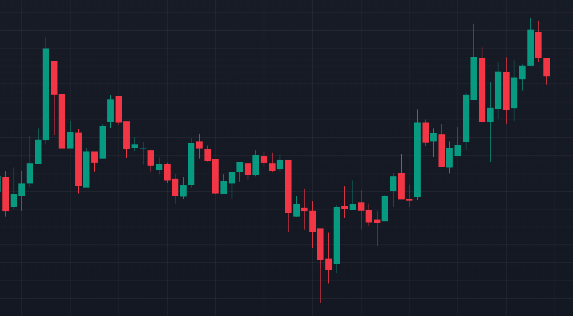
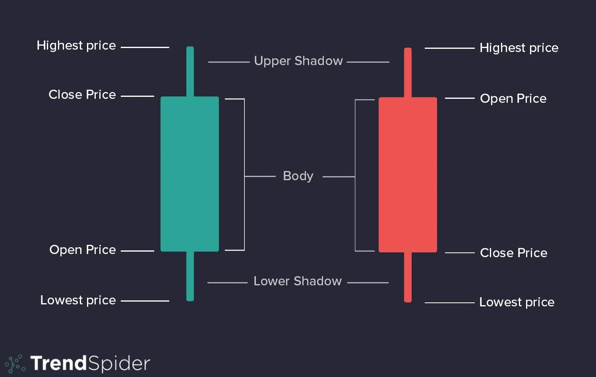

# F# Finance guide

Candle sticks

Candle explanation

> This walktrough created for people who interesting to use F#
for finances analyze

This guide will walkthrough steps using F# in data analyzing

## Prerequisites

Before start using F# and this repository you should have basic 
understanding of using F# and Visual Studio. At least go through 
Microsoft tutorial for F# 
[tutorial](https://learn.microsoft.com/en-us/dotnet/fsharp/what-is-fsharp)

## Information

Here is a list of tech indicators 
[link](https://www.investopedia.com/terms/t/technicalindicator.asp)
used for tech analyze and creating signals.

## Functionalities

These indicators are calculated in this guide:
- [RSI](https://www.investopedia.com/terms/r/rsi.asp) (Reletive Strength Index)
- [MFI]() (https://www.investopedia.com/terms/m/mfi.asp) (Money Flow)
- [Stochastic Oscillator](https://www.investopedia.com/terms/s/stochasticoscillator.asp)
- [ROC](https://www.investopedia.com/terms/p/pricerateofchange.asp) (Price Rate of Change)
- [SMA](https://www.investopedia.com/terms/e/ema.asp) 
(Simple Moving Avarage)
- [EMA](https://www.investopedia.com/articles/mutualfund/08/managed-separate-account.asp) 
(Simple Moving Avarage)
- [BBands](https://www.investopedia.com/terms/b/bollingerbands.asp) (Bollinger Bands)
- Searching intersection

## Steps

- Build the solution
- Choose project to start
- Hit F5
- Watch the result

## Plans

Basic plan is to finish this guide until all formulas, indecators
are accurate on calculations, design Strategy class to have a posibility
to test strategies are working. Maybe create a package for all these 
functionalities, AI with SciSharp, pack indicators and formulas to a 
package which depends on how many people will interest in this project

- [ ] Guide
- [ ] Do separate example with Deedle
- [ ] Strategy class

## Thanks

[@DaveSkender](https://github.com/DaveSkender/) - whos
[package](https://github.com/DaveSkender/Stock.Indicators) we are using to
calculate indicator

[Plotly](https://github.com/plotly/Plotly.NET) as we
using this package to plot indicators